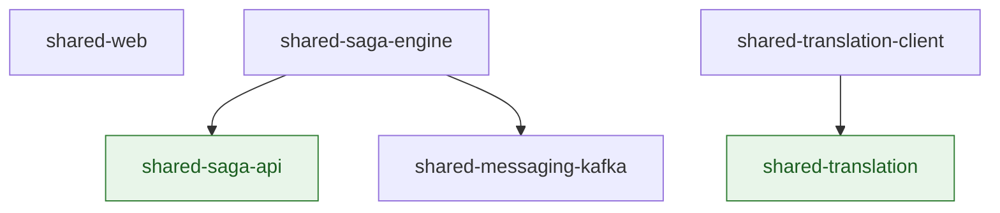

# Shared Modules

Six libraries are shared across the services. This page is the canonical answer to "what is in
which, and why is it separate".

## The two rules

A module exists here for one of exactly two reasons. Everything else is a judgment call that
these two rules already settle.

1. **A module is framework-free when the application layer needs it.** The hexagonal rule says
   the application layer never sees Spring. A separate module with nothing but the Kotlin
   standard library on its classpath turns that rule into a compile error instead of a check
   that runs afterward.
2. **A module is separate only when some consumer takes it without the rest.** If every
   consumer of A also takes B, splitting A from B produces two modules with one dependency
   graph and twice the maintenance — a cost with no reader and no reuse behind it.

> [!NOTE]
>
> The second rule is why there is no `shared-messaging-api`. The outbox types look like they deserve an api/engine
> split the way the saga types got one, but no application layer anywhere in the repo imports them: the outbox is
> written from outbound adapters, entirely inside the infrastructure layer. An api module there would have exactly
> the same consumers as the engine — two modules, one dependency graph, no reuse.

## The modules

### Framework-free

Kotlin standard library only. Safe to name from an application layer.

| Module               | Responsibility                                                                                 |
|----------------------|------------------------------------------------------------------------------------------------|
| `shared-saga-api`    | The saga vocabulary: `Saga`, `SagaStep`, `SagaStatus`, `SagaStepStatus`, `SagaTypeValue`       |
| `shared-translation` | The key-declaration DSL, the ICU renderer and pattern validation (ICU4J is its one dependency) |

### Spring

| Module                      | Responsibility                                                                                              |
|-----------------------------|-------------------------------------------------------------------------------------------------------------|
| `shared-web`                | Keycloak JWT converters (servlet and reactive), ETag and optimistic-locking helpers, shared config defaults |
| `shared-messaging-kafka`    | Transactional outbox, consumer deduplication, Avro serialisation and Schema Registry wiring                 |
| `shared-saga-engine`        | Saga orchestration, compensation, the watchdog, and the JPA flavour of the saga ports                       |
| `shared-translation-client` | Start-up registration of a service's translation keys with `translation-service`                            |
| `shared-archunit`           | The architecture rules every service is checked against, as executable tests                                |

## The dependency graph

Arrows point at what a module depends on. There are no cycles, and nothing framework-free
depends on anything Spring-bound.



`shared-web` and `shared-messaging-kafka` depend on no other shared module. That is deliberate:
`shared-web` is the only library the reactive gateway takes, so anything added to it is added
to the gateway too.

## Who takes what

| Service                                          | Takes                                                               |
|--------------------------------------------------|---------------------------------------------------------------------|
| api-gateway                                      | `shared-web`                                                        |
| translation-service                              | `shared-web`, `shared-translation`                                  |
| file-service                                     | `shared-web`, `shared-translation-client`, `shared-messaging-kafka` |
| iam, mail, project, task, notification, template | all six                                                             |

Two of these are worth reading as evidence that the boundaries are real rather than decorative:

- **api-gateway takes one module.** It is reactive and has no database. Before the split it
  pulled in the whole Spring/JPA/Kafka/Avro surface for a single JWT converter, and had to
  disable Hibernate autoconfiguration in two places to survive it.
- **file-service takes the outbox but not the saga engine.** It publishes events and
  orchestrates nothing, so it carries outbox tables and no saga tables.

## Writing a new service: what do I take?

Answer three questions. `template-service` is the worked example — it takes all six.

1. **Does it serve HTTP and authenticate callers?** Take `shared-web`. Every service does, including the gateway.
2. **Does it publish or consume integration events?** Take `shared-messaging-kafka`, and copy the outbox and
   processed-event tables from an existing service's first migration. If the answer is no, take neither — and do not
   create those tables. `translation-service` carried four empty ones for exactly this reason until they were removed.
3. **Does it orchestrate a multiservice workflow that can fail halfway?** Take `shared-saga-engine` (which pulls
   `shared-saga-api` for you) and add the saga tables. Publishing an event is not orchestration: `file-service`
   publishes and takes no saga engine.

If the service declares translation keys, add `shared-translation-client`; the DSL itself arrives with it.

Every service also takes `shared-archunit` on its **test** classpath. It ships no production code — it is
the rule set above, executable.

## Adding a module

Before adding one, check it against the two rules at the top. In practice:

- Does an application layer need to name these types? If yes, it belongs in a framework-free
  module.
- Will some consumer take it *without* the module it would otherwise live in? If no, put it in
  the existing module.

A module also has to be wired in four places, which is the real cost of getting this wrong:
its own `settings.gradle.kts` and version catalogue, the root `settings.gradle.kts`, the
`documentedLibraries` list in the root `build.gradle.kts`, and a `shared-*-checks.yml`
workflow. Services that consume it need it in their `settings.gradle.kts`, their build file and
their `Dockerfile`.

## API documentation

Every module publishes its KDoc:

```bash
./gradlew docs
```

Output lands in `docs/dokka/`, one directory per module behind a generated index.
