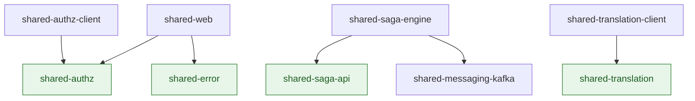

# Shared Modules

Six libraries are shared across the services. This page is the canonical answer to "what is in
which, and why is it separate".

## The two rules

A module exists here for one of exactly two reasons. Everything else is a judgment call that
these two rules already settle.

1. **A module is framework-free when the application layer needs it.** The hexagonal rule says
   the application layer never sees Spring. A separate module with nothing but the Kotlin
   standard library on its classpath turns that rule into a compile error instead of a check
   that runs afterward.
2. **A module is separate only when some consumer takes it without the rest.** If every
   consumer of A also takes B, splitting A from B produces two modules with one dependency
   graph and twice the maintenance — a cost with no reader and no reuse behind it.

> [!NOTE]
>
> The second rule is why there is no `shared-messaging-api`. The outbox types look like they deserve an api/engine
> split the way the saga types got one, but no application layer anywhere in the repo imports them: the outbox is
> written from outbound adapters, entirely inside the infrastructure layer. An api module there would have exactly
> the same consumers as the engine — two modules, one dependency graph, no reuse.

## The modules

### Framework-free

Kotlin standard library only. Safe to name from an application layer.

| Module               | Responsibility                                                                                 |
|----------------------|------------------------------------------------------------------------------------------------|
| `shared-saga-api`    | The saga vocabulary, plus `SagaProcessPort` and the `SagaSnapshot` an application service sees |
| `shared-translation` | The key-declaration DSL, the ICU renderer and pattern validation (ICU4J is its one dependency) |
| `shared-authz`       | The permission-declaration DSL, role scopes, and the projection port every service implements  |
| `shared-error`       | `DomainError` and `ApiException`: the contract each service's error catalogue implements       |

### Spring

| Module                      | Responsibility                                                                                              |
|-----------------------------|-------------------------------------------------------------------------------------------------------------|
| `shared-web`                | Keycloak JWT converters (servlet and reactive), the error-to-HTTP mapping, ETag helpers, config defaults    |
| `shared-messaging-kafka`    | Transactional outbox and inbox — contract, JPA mapping and adapters — plus Avro and Schema Registry wiring  |
| `shared-saga-engine`        | One service's local saga: the state machine, compensation, the watchdog, and the JPA flavour of its ports   |
| `shared-translation-client` | Start-up registration of a service's translation keys with `translation-service`                            |
| `shared-authz-client`       | Start-up registration of a service's permission catalogue with `iam-service`                                |
| `shared-archunit`           | The architecture rules every service is checked against, as executable tests                                |

## The dependency graph

Arrows point at what a module depends on. There are no cycles, and nothing framework-free
depends on anything Spring-bound.



`shared-messaging-kafka` depends on no other shared module. `shared-web` takes two:
`shared-authz`, for the `@authz.has('…')` guard every servlet service writes, and `shared-error`,
whose `DomainError` the single `@RestControllerAdvice` turns into a status and a body. Both stay
framework-free and add nothing the reactive gateway cannot carry — `shared-web` is the only
library the gateway takes, so anything heavier added to it is added to the gateway too.

## Who takes what

Every service takes the same four: `shared-web`, `shared-error`, `shared-translation` and
`shared-messaging-kafka`, plus `shared-archunit` on the test classpath. What differs is the rest.

| Service                                | Beyond those four                                                    |
|----------------------------------------|----------------------------------------------------------------------|
| api-gateway                            | none — and none of the four either, only `shared-web`                |
| translation-service                    | `shared-authz`, `shared-authz-client`                                |
| file-service                           | `shared-translation-client`                                          |
| notification-service, template-service | `shared-translation-client`, `shared-saga-api`, `shared-saga-engine` |
| iam-service                            | the three above plus `shared-authz`                                  |
| mail, project, task                    | everything                                                           |

Three of these are worth reading as evidence that the boundaries are real rather than decorative:

- **api-gateway takes one module.** It is reactive and has no database, and all it needs from
  the shared code is a JWT converter. A library that also carried JPA would force it to disable
  Hibernate autoconfiguration to start at all.
- **file-service takes the outbox but not the saga engine.** It publishes events and
  orchestrates nothing, so it carries outbox tables and no saga tables.
- **iam-service takes `shared-authz` but not `shared-authz-client`.** The client registers a
  catalogue *with* iam; iam is the registry and reads its own.

## Writing a new service: what do I take?

Answer three questions. `template-service` is the worked example — it takes all six.

1. **Does it serve HTTP and authenticate callers?** Take `shared-web`. Every service does, including the gateway.
2. **Does it publish or consume integration events?** Take `shared-messaging-kafka`, copy the `kafka_outbox` and
   `processed_event` tables from an existing service's first migration, and name the matching packages in
   `@EntityScan` and `@EnableJpaRepositories` — the mapping and the adapters come from the module, only the tables
   are yours. Consuming without publishing takes the inbox half alone: `translation-service` creates no
   `kafka_outbox` and excludes the outbox beans from its component scan.
3. **Does it take part in a multiservice workflow that can fail halfway?** Take `shared-saga-engine` (which pulls
   `shared-saga-api` for you) and add the saga tables — the engine tracks this service's own steps, and nobody's
   else. Publishing an event is not taking part: `file-service` publishes and takes no saga engine.

If the service declares translation keys, add `shared-translation-client`; the DSL itself arrives with it.

Every service also takes `shared-archunit` on its **test** classpath. It ships no production code — it is
the rule set above, executable.

## Adding a module

Before adding one, check it against the two rules at the top. In practice:

- Does an application layer need to name these types? If yes, it belongs in a framework-free
  module.
- Will some consumer take it *without* the module it would otherwise live in? If no, put it in
  the existing module.

A module also has to be wired in four places, which is the real cost of getting this wrong:
its own `settings.gradle.kts` and version catalogue, the root `settings.gradle.kts`, the
`documentedLibraries` list in the root `build.gradle.kts`, and a `shared-*-checks.yml`
workflow. Services that consume it need it in their `settings.gradle.kts`, their build file and
their `Dockerfile`.

The `Dockerfile` and the workflow `paths:` list take the **transitive** closure, not the direct
dependencies. A composite build fails at settings evaluation when an included build's directory
is absent, so a service that copies `shared-web` must copy everything `shared-web` includes —
otherwise the image stops building even though the service names none of it. The same closure
decides the `paths:` triggers: a workflow that does not fire on a dependency's change does not
report a failure, it reports nothing.

## API documentation

Every module publishes its KDoc:

```bash
./gradlew docs
```

Output lands in `docs/dokka/`, one directory per module behind a generated index.
